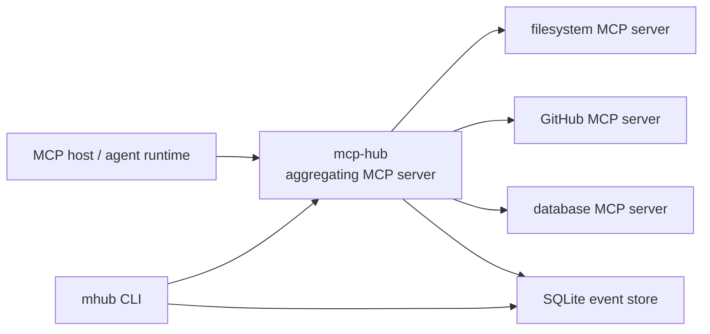

# mcp-hub

One MCP endpoint for many MCP servers, with visibility into what is alive, what is failing, and what your agent can call.

`mcp-hub` is an early-stage Python CLI and gateway for the [Model Context Protocol](https://modelcontextprotocol.io/). Upstream MCP hosts connect to `mcp-hub` as a single MCP server. `mcp-hub` then maintains separate MCP client sessions to configured downstream MCP servers, exposes a namespaced view of their tools, resources, and prompts, and records routing, latency, error, and optional usage metadata.

The goal is simple: give agents one clean MCP connection, and give humans one place to inspect the MCP stack.

## Status

This repository is at the project-definition stage. The CLI is not installable yet, and the commands below describe the intended workflow rather than a released interface.

The first usable milestone will focus on local development with stdio-based MCP servers. Remote transports, OAuth flows, and richer dashboards belong later.

## Why mcp-hub

MCP makes it easier for AI applications to connect to external tools and data sources, but a real setup can become hard to inspect once you add several servers. You may have a filesystem server, a GitHub server, a database server, a docs server, and a few custom internal tools. When something breaks, the agent often sees only a missing tool or a failed call.

`mcp-hub` aims to sit in the middle:

- The agent connects to one MCP endpoint.
- The hub connects to many downstream MCP servers.
- Tool, resource, and prompt names stay collision-free through namespacing.
- The CLI shows server health, discovered capabilities, recent calls, latency, and errors.
- Usage and token data are recorded when a downstream server, caller, or provider integration supplies it.

## Intended workflow

```bash
# Add downstream MCP servers to one config file.
$EDITOR mhub.yaml

# Start the gateway.
mhub run

# Inspect connected servers.
mhub ls

# List the tools exposed to the upstream host.
mhub tools

# Check routing, latency, errors, and optional usage metadata.
mhub stats
```

An upstream MCP host, such as an agent runtime or desktop assistant, would connect to `mcp-hub` instead of connecting to every downstream server directly.

## Example config

The exact schema may change before the first release, but the intended config should stay small and readable:

```yaml
servers:
  filesystem:
    transport: stdio
    command: npx
    args:
      - "@modelcontextprotocol/server-filesystem"
      - ./workspace

  github:
    transport: stdio
    command: uvx
    args:
      - mcp-server-github
    env:
      GITHUB_TOKEN: ${GITHUB_TOKEN}

observability:
  store: sqlite
  database: .mhub/events.db
  capture_payloads: false
```

If both downstream servers expose a tool named `search`, `mcp-hub` would publish namespaced tools such as `filesystem__search` and `github__search`, then route calls back to the original server and tool.

## Planned commands

| Command | Purpose |
| --- | --- |
| `mhub run` | Start the local MCP gateway. |
| `mhub ls` | Show configured servers and health status. |
| `mhub tools` | Show the aggregated tool surface exposed upstream. |
| `mhub inspect <server>` | Show one server's transport, capabilities, tools, prompts, resources, and last errors. |
| `mhub doctor` | Validate config, auth hints, server startup, and capability discovery. |
| `mhub logs` | Show recent calls, routing decisions, errors, and response summaries. |
| `mhub stats` | Show call counts, latency, failures, and optional usage metadata by server and tool. |

## MVP scope

The first version should be boring in the best way:

- Python CLI built with a small, testable core.
- Stdio downstream MCP server support.
- One local upstream MCP server surface for agent hosts.
- Capability discovery for tools, resources, and prompts.
- Namespaced aggregation with explicit collision handling.
- Tool call proxying with per-call logs.
- Health checks and `doctor` output.
- SQLite-backed event history for local observability.

## Token and usage accounting

Usage accounting in `mcp-hub` is best-effort. MCP tool calls do not automatically include LLM token counts, and downstream MCP servers may not know what an upstream agent or model provider spent.

`mcp-hub` can record usage metadata when a server, caller, or provider integration supplies it. Do not treat the hub as a billing source of truth unless your deployment wires in verified provider usage data.

## Architecture sketch



`mcp-hub` is not the LLM runtime and does not decide how an agent uses context. It acts as a gateway and observability layer around MCP server connections.

## Documentation

- [Architecture](docs/architecture.md)
- [Roadmap](docs/roadmap.md)
- [Security](SECURITY.md)
- [Agent instructions](AGENTS.md)

## License

MIT
