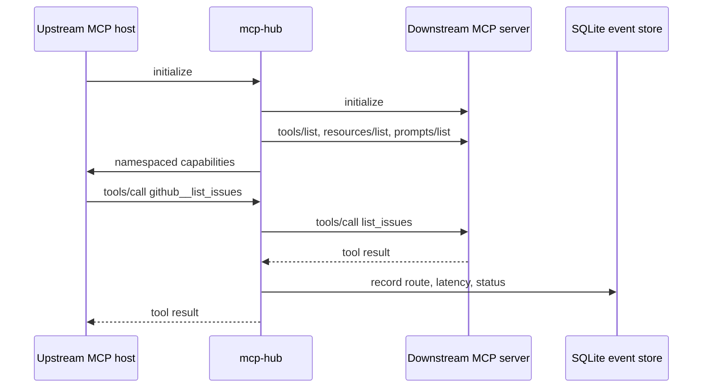

# Architecture

`mcp-hub` is planned as a local MCP gateway with a CLI-first control plane. It exposes one MCP server surface upstream and maintains separate MCP client sessions to configured downstream MCP servers.

This design is unstable until the first implementation lands.

## Participants

- **Upstream MCP host**: An AI application, desktop assistant, editor, or agent runtime that connects to `mcp-hub` as an MCP server.
- **mcp-hub gateway**: The process that exposes aggregated MCP capabilities and routes requests to downstream servers.
- **Downstream MCP server**: A configured MCP server that provides tools, resources, and prompts.
- **mhub CLI**: The human-facing command line tool for config checks, inspection, health, logs, and stats.
- **Event store**: A local SQLite database for call metadata, health events, latency, errors, and optional usage metadata.

## High-level flow

## Core components

### Config loader

The config loader reads `mhub.yaml`, expands environment references, validates required fields, and returns typed server definitions. It should not start processes or open network connections.

### Server registry

The registry owns the configured downstream server list, their runtime status, and their discovered capabilities. It should keep each downstream server isolated so a failed server does not poison the full aggregate surface.

### MCP session manager

The session manager starts and supervises downstream MCP client sessions. The first milestone should focus on stdio sessions. Streamable HTTP, OAuth, and remote lifecycle details should wait until the stdio path is solid.

### Aggregator

The aggregator builds the upstream tool, resource, and prompt surface. It should namespace downstream capabilities, detect collisions, and keep a reversible mapping from exposed names back to downstream server identifiers.

For example:

| Exposed name | Downstream server | Downstream name |
| --- | --- | --- |
| `github__list_issues` | `github` | `list_issues` |
| `filesystem__read_file` | `filesystem` | `read_file` |

Resources need extra care because MCP resources are identified by URI. The hub should either rewrite resource URIs or expose a stable hub URI that maps back to the downstream server and original URI.

### Router

The router receives upstream calls, resolves the namespaced target, forwards the request to the right downstream session, and returns the downstream result. It should record success, failure, latency, and routing metadata for each call.

### Observability store

The observability store records metadata for inspection:

- Server startup and health events
- Capability discovery results
- Tool call route, status, latency, and error class
- Optional usage metadata when provided by a downstream server, caller, or provider integration

Payload capture should stay disabled by default.

### CLI

The CLI reads local config and the event store. Commands such as `mhub ls`, `mhub tools`, `mhub doctor`, `mhub logs`, and `mhub stats` should work without requiring a web UI.

## MVP transport choices

The first milestone should support:

- Downstream stdio MCP servers
- One local upstream MCP server interface
- Local SQLite observability

Later milestones can add Streamable HTTP, remote auth, live dashboards, and richer policy controls.

## Design constraints

- Keep capability names deterministic.
- Keep per-server state isolated.
- Make collision handling explicit.
- Treat token and usage accounting as optional metadata.
- Avoid logging secrets or payloads by default.
- Prefer clear failure states over silent partial aggregation.
